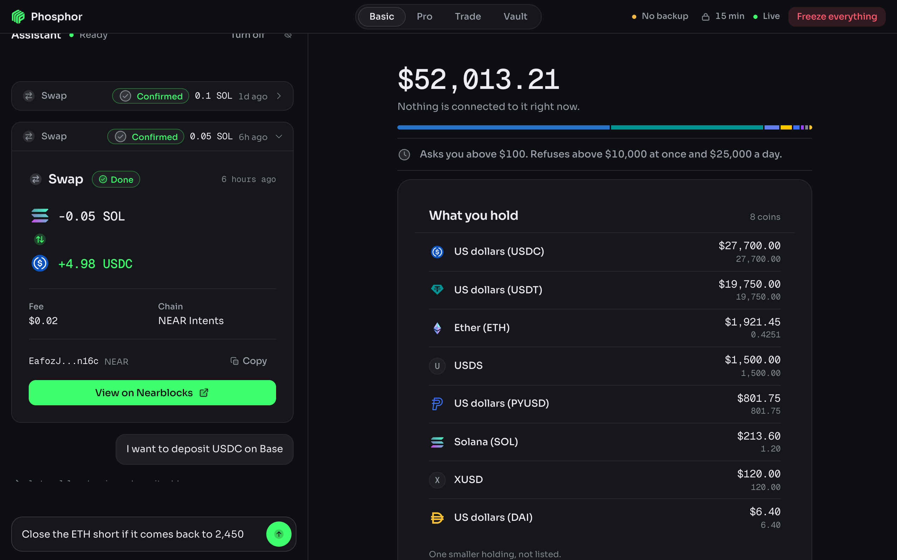

<p align="center">
  
</p>

<h1 align="center">Phosphor</h1>

<p align="center">
  A Mac app that holds real money and lets an AI agent move it.<br>
  Every move stops and waits for your click.
</p>

<p align="center">
  <a href="https://phosphor.money/download/mac"><b>Download for Mac</b></a>
  &nbsp;·&nbsp;
  <a href="https://phosphor.money/docs">Docs</a>
  &nbsp;·&nbsp;
  <a href="DISCLAIMER.md">Read before you fund it</a>
</p>

<p align="center">
  <a href="https://github.com/karimbabasf/phosphor/actions/workflows/ci.yml"></a>
  <a href="https://github.com/karimbabasf/phosphor/releases/latest"></a>
  <a href="LICENSE"></a>
</p>

<p align="center">
  
</p>

## What it is

The app is the car. The agent is the driver. You hold the key.

Phosphor runs on your Mac and nowhere else. There is no server, no account and no telemetry. Your
keys sit in an enclave-wrapped file on your own disk. Any MCP agent drives the app (Claude Code,
Codex, anything that speaks MCP), or the app runs its own assistant. The agent reads your money,
prices a move and proposes it. The agent can never approve. Every execution takes a click in the
window, and the policy engine runs your rules with no model in the path.

Two venues, and only two. A swap reaches any coin NEAR Intents lists, on any chain it lists. A
payout reaches every chain whose address the app can decode by itself: every EVM chain, Solana,
Fogo and NEAR. Any other chain is refused by name. Perps run on Hyperliquid.

This is alpha software that moves real money. It has had no third-party audit. It is not a wallet
service, an exchange, a broker or an adviser, and nothing it or your agent says is financial
advice. Read [DISCLAIMER.md](DISCLAIMER.md) first.

## Install

[Download the disk image](https://phosphor.money/download/mac). Apple silicon, macOS
13.5 or later. Drag Phosphor into Applications.

The app holds keys, so check the file first. The release page lists the SHA-256 of the disk image,
and this must print the same one:

```sh
shasum -a 256 ~/Downloads/Phosphor-macOS-arm64.dmg
```

The build is signed ad hoc and is not notarised by Apple, so the first open stops with a warning
saying macOS cannot check it for malware. This is expected and the app is not broken. Open it
once and let it be refused (click Done, not Move to Trash), then double-click **Open Anyway** in
the disk image window: it opens System Settings, Privacy & Security, at the Open Anyway button
next to Phosphor. Click it. That button appears only after a refused open, and only for about an
hour. On macOS 14 and earlier you can instead right-click Phosphor in Applications and choose
Open.

## Connect an agent

The first run asks which agent you use and registers Phosphor with it. To do it by hand later,
**Phosphor > Copy MCP Config** in the menu bar puts the one line on your clipboard with your real
paths filled in. Run it in the directory you want the agent to work from.

Then ask it things.

> What do I hold?
>
> Swap 20 USDC into WETH.
>
> Short SOL at 10x if it loses that trend line, and cap me at $200.

Details, and what the agent can never do, are in
[docs/connect-an-agent.md](docs/connect-an-agent.md).

## Run from source

Needs Node 24 or later and a Rust toolchain.

```sh
npm install
npm run tauri dev
```

That opens the window. `npm run app` runs the backend alone on http://127.0.0.1:4177, and
`npm run app:build` writes the app and the disk image under `src-tauri/target/release/bundle/`.
To point Claude Code at the checkout instead of the installed app:

```sh
claude mcp add phosphor -- node "$PWD/src/mcp.ts"
```

## Test

```sh
npm test         # unit, injection and lockdown suites
npm run typecheck
npm run eval     # scores the agent against the behaviour rubric
```

## Docs

Read them at [phosphor.money/docs](https://phosphor.money/docs), or in
[docs/](docs/README.md).

- [Getting started](docs/getting-started.md): download, wallet, backup, the lock and the brake.
- [Security model](docs/security-model.md): the trust boundary, the fail-closed rules, the limits.
- [Known limits](docs/known-limits.md): what this build does not cover.
- [Architecture](docs/architecture.md) and [Reference](docs/reference.md): for people changing it.
- [SECURITY.md](SECURITY.md): reporting a vulnerability privately.
- [CONTRIBUTING.md](CONTRIBUTING.md): the bar for a change.

## License

Functional Source License 1.1 with an MIT future license
([FSL-1.1-MIT](LICENSE)). Read it, run it, change it, audit it. You may not offer Phosphor, or a
product that does what Phosphor does, to other people as a commercial product or service. Each
version turns MIT two years after its release. The fonts and token logos carry their own notices
in `ui/fonts/OFL.txt` and `ui/logos/LICENSE.md`.
