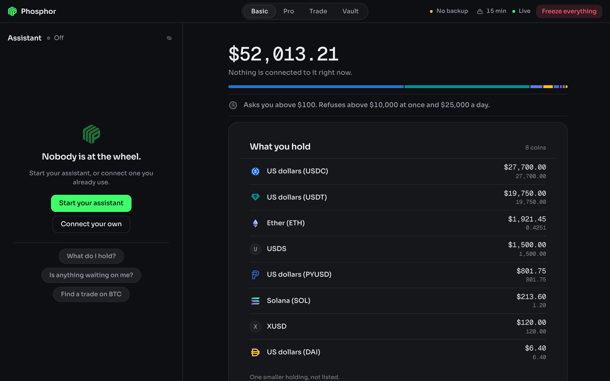

# Phosphor

Phosphor is a local Mac app that holds your keys, your venue connections and your rules. Any MCP
agent (Claude Code, Codex, anything that speaks MCP) drives it: the agent reads your money, prices
a move and proposes it. The agent can never approve. Every execution takes a click in the app
window, and the policy engine runs your rules with no model in the path. Two venues, and only two:
NEAR Intents and Hyperliquid. This is alpha software that moves real money. Read
[DISCLAIMER.md](DISCLAIMER.md) before you fund it.

## Install

Download the disk image from [phosphor.karimbabasf.com](https://phosphor.karimbabasf.com). Apple
silicon, macOS 13.5 or later. Open the disk image and drag Phosphor into Applications.

The app holds keys, so check the file before you open it. The release page lists the SHA-256 of
the disk image, and this line must print the same one:

    shasum -a 256 ~/Downloads/Phosphor-macOS-arm64.dmg

The build is not notarized by Apple yet, so the first open stops with a warning. Open System
Settings, Privacy & Security, scroll to Security and click Open Anyway.

## Connect an agent

Register the installed app with Claude Code:

    claude mcp add-json phosphor "{\"command\":\"/Applications/Phosphor.app/Contents/MacOS/node\",\"args\":[\"/Applications/Phosphor.app/Contents/Resources/phosphor/src/mcp.ts\"],\"env\":{\"PHOSPHOR_PORT\":\"4177\",\"PHOSPHOR_DATA_DIR\":\"$HOME/Library/Application Support/com.karimbabasf.phosphor/state\"}}"

Phosphor > Copy MCP Config in the menu bar puts this line on the clipboard with the real paths
of your installation filled in. Run it in the directory you want the agent to work from.

The window can also start the agent itself. Start your assistant spawns a headless Claude Code
session that sees Phosphor's tools and nothing else: no shell, no files, no web, and no way to
approve its own proposals. It needs the `claude` CLI installed and logged in.

Then ask it things. "What do I hold?" "Swap 20 USDC into WETH." "Short SOL at 10x if it loses
that trend line, and cap me at $200."

## Run from source

Needs Node 24 or later and a Rust toolchain.

    npm install
    npm run tauri dev

That opens the window. `npm run app` runs the backend alone at http://127.0.0.1:4177. To point
Claude Code at a source checkout instead of the installed app, run this from the repo root:

    claude mcp add phosphor -- node "$PWD/src/mcp.ts"

`npm run app:build` writes the app and the disk image under `src-tauri/target/release/bundle/`.

## Test

    npm test            # the unit suite, the injection suite and the lockdown suite
    npm run typecheck   # tsc --noEmit over src, tests and scripts
    npm run e2e         # boots the app and a real MCP client over stdio, exits 0 or 1

## Docs

User documentation: [phosphor.karimbabasf.com/docs](https://phosphor.karimbabasf.com/docs).
Source: [docs/README.md](docs/README.md).

- [Architecture](docs/architecture.md): the two-process topology, module map, data flow and
  failure modes.
- [Security model](docs/security-model.md): the trust boundary, the three verdicts, fail-closed
  rules, the approval token and the v1 limits.
- [Reference](docs/reference.md): the tool surface, policy as sentences, the first run, config,
  keys and signing.
- [Security](SECURITY.md): how to report a vulnerability privately.

## License

Functional Source License 1.1 with an MIT future license (FSL-1.1-MIT). See [LICENSE](LICENSE).
The code is open to read, run, change and audit. What it does not allow is offering Phosphor, or
a product that does what Phosphor does, to other people as a commercial product or service. Each
version becomes MIT two years after its release. The fonts and the token logos carry their own
notices in `ui/fonts/OFL.txt` and `ui/logos/LICENSE.md`.
